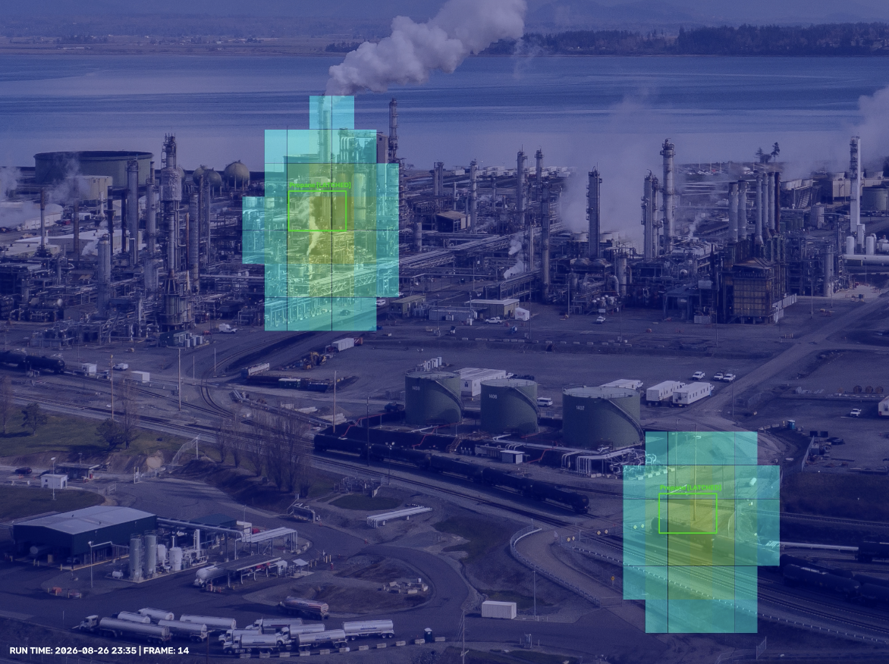

# FTIR Plume Simulation & Optical Tracking Engine (POC / Demo Only)

A C++ and OpenCV-powered simulation engine that models advanced hyperspectral infrared spectroscopy (FTIR) gas cloud detection, multi-plume classification, and spatial tracking. 

---

## What It Does & Why

Conventional industrial gas safety systems rely on point-contact sensors (like the human "nose") that require a gas cloud to physically touch the detector. However, gas clouds drift unpredictably, leaving critical blind spots (the Health and Safety Executive notes that a significant percentage of major releases go undetected by fixed sensors). This project simulates a wide-area remote-sensing technology:
* **Visual Remote Sensing:** Instead of point-contact sensors, it acts like the human "eye," scanning a wide-area industrial plant background (`gas_refinery.png`).
* **Randomized Multi-Cloud Generation:** Spawns a consistent, randomized number of gas plumes (0 to 5) per session, featuring multiple gas types (Ammonia, Methane, Chlorine, Propane, Hydrogen Sulfide).
* **Behavioral Variability:** Each cloud is independently assigned a behavior mode for the run—either **stationary** or **drifting** with simulated wind turbulence.
* **Computer Vision & Thermal Overlays:** Performs spatial anomaly detection, applies a pseudocolor heatmap (`COLORMAP_JET`), and alpha-blends the moving plume overlays directly onto the high-resolution refinery image.
* **Automated Run Output:** Automatically generates a unique, timestamped output directory (`run_YYYYMMDD_HHMMSS/`) for every execution containing individual frame snapshots and an animated H.264 `.mp4` video.

---

## Project Structure

* `tracker_engine.cpp`: The core C++ engine handling the simulation grid, randomized scenario creation, computer vision anomaly isolation, timestamp watermarking, and OpenCV video/image rendering.
* `CMakeLists.txt`: Build configuration file linking OpenCV libraries.
* `gas_refinery.png`: The background asset image representing an industrial plant facility.
* `run_*/`: Unique output directories automatically generated upon execution containing the rendered frames and animated video.

---

## Prerequisites & Installation

Make sure you have a C++ compiler supporting C++17, CMake, and OpenCV installed on your system.

### On macOS (via Homebrew):
```bash
brew install opencv cmake
```

### How to Build and Run
Clone the repository and enter the directory:
```bash
git clone git@github.com:dirkjbosman/ftir_opencv_sim.git
cd ftir_opencv_sim
```

Create and enter a build directory:
```bash
mkdir build
cd build
```

Generate the build files using CMake:
```bash
cmake ..
```

Compile the engine:
```bash
make
```

Run the executable (detect, classify, and tracking algorithm):
```bash
./tracker_engine
```

Upon execution, the terminal will log the randomized scenario parameters, and a new unique folder (e.g., run_20260826_234512/) will appear containing your sequence of frames (.png) and your compiled simulation video (ftir_simulation_output.mp4).

### Simulation Demo Preview

Here is an example output of the simulation rendering randomized gas plumes with heatmaps and target bounding boxes over the industrial refinery background: 

> **[Click here to play/download the full animated MP4 simulation](./ftir_simulation_output.mp4)**

[](./ftir_simulation_output.mp4)

